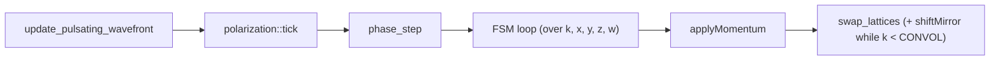

# The Cellular Automaton FSM — a glimpse of the machine's brain

> An operational view of the finite state machine that drives the light cycle.
> All variables (`EL`, `W_USED`, `RMAX`, `CENTER`, `k`, `t`, `ch`, `a`,
> `u`, `v`, `r²`, `active`, `s2B`, `pB`, `sB`, `kB`, `c[]`, `m[]`, `reloc[]`,
> `bstamp`…) are assumed to be predefined (manuscript, variable table).
> `file:line` references point to the current state of the code.

---

## 1. The two clocks

| Clock | Scope | Role |
|---|---|---|
| **`k`** (housekeeping) | Global, synchronous: all cells share the same value | The FSM schedule: cycles through `0 … FRAME−1` and selects the phase |
| **`t`** (local light-frame) | Per source; reset at each interaction | Physical clock: advances by 1 per frame and feeds `effective_t(t)` |

`effective_t(t)` folds `t` into a **triangle wave** of period `2·RMAX` and
amplitude `RMAX`: expansion `0→RMAX` followed by contraction `RMAX→0`.
That is the pulse.

---

## 2. The light cycle (one tick = one frame)



| Stage | Function | Effect |
|---|---|---|
| 1. Distance field | `update_pulsating_wavefront` | Relaxes `r²`/`r` over the **periodic** 6-neighborhood (3-torus geodesics); anchors `r²=0` at source centers |
| 2. Polarization | `polarization::tick()` | Helical walker seeds payloads; axis election at the expansion limit (`t == RMAX`); writes arrival stamps `b(x)` → `bstamp` |
| 3. Wave medium | `phase_step` | Advances `(u,v)` (damped wave equation), marks the active shell (`r == pulseR`), computes `s2B` (the sieve) and reconstructs `(pol_u,pol_v)` from `bstamp` |
| 4. FSM | dispatch by `k` | Convolution / diffusion / relocation / reissue / flood (Section 4) |
| 5. Impulse | `applyMomentum` | Consumes `reloc`, moves the source center (torus), consumes `P` pairs at `t==RMAX` |
| 6. Swap | lattice rotation | Re-labels main/draft/mirror; `shiftMirror()` during the convolution window |

---

## 3. The phase ruler (thresholds in `calculateParameters`)

```
RMAX      = L/2
CONVOL    = W_USED
GSLOT_X   = CONVOL  + 2·RMAX
GSLOT_Y   = GSLOT_X + 2·RMAX
GSLOT_Z   = GSLOT_Y + 2·RMAX
SLOT1     = GSLOT_Z + RMAX
SLOT2     = SLOT1   + 3·(L−1)
SLOT3     = SLOT2   + 3·(L−1)
SLOT4     = SLOT3   + 2·W_USED
DIFFUSION = SLOT5   = SLOT4 + 3·(L−1)
SLOT6     = DIFFUSION + (L−1)
SLOT7     = SLOT6 + (L−1)
RELOC     = SLOT8 = SLOT7 + (L−1)
REISSUE   = RELOC + 1
FRAME     = FLOOD = REISSUE + 3·(L−1)
```

### Dispatch by `k` (simulation.cpp:583-595)

| `k` range | Executor | Content |
|---|---|---|
| `k < CONVOL` | `convolute(curr,draft,mirror)` | Bubble encounters (Section 4) |
| `CONVOL ≤ k < GSLOT_Z` | — (*glider* slots, reserved) | Empty |
| `GSLOT_Z ≤ k < DIFFUSION` | `diffuse(...)` | Spreads orphans and translation vectors (Section 5) |
| `DIFFUSION ≤ k < RELOC` | `relocate(...)` | Moves payload while consuming `c[]` (Section 6) |
| `k == RELOC` | `reissue(...)` | Clears collapse flags; propagates affinity outward (Section 7) |
| `REISSUE ≤ k < FLOOD` | `flood(...)` | Completes the frame (Section 7) |

End of frame: `draft.k = (curr.k + 1) % FRAME`; when `draft.k == 0` the local
clock advances: `t++` if `a == W_USED && t <= RMAX`, otherwise
`t = (t + 1) % (2·RMAX)` — the fine folding is handled by `effective_t`.

## 4. The convolution window (`k < CONVOL`) — the encounter rules

**Meeting schedule:** on every frame of this window, `shiftMirror()` rotates
the mirror lattice's `w` slices (utils.cpp:34-54; trigger at
simulation.cpp:651-654). Thus `mirror[x,y,z,w]` holds a *different* layer,
and layer `w`'s partner queue cycles through all other layers across the
`W_USED` frames. Encounter = internal topology, geometry-independent.

**Gates in cascade (interaction.cpp:174-185):**
1. `curr.active && mirror.active` — active shells only;
2. distinct layers (`x[3] ≠ mirror.x[3]`);
3. sieve armed: `curr.s2B`.

**Pair formation (lines 201-244):** with `samePos && sameT &&
canFormPair(ch)` (charge-complementarity rules 1-6, anticharge as the
`^ 0x3F` complement), both sources become `kind=P` (*dressing* pairs if they
share a leader; free *photons* otherwise) and reemit at the contact point
(`reemitAtContact`: `t=f=0`, `reloc += Δ`).

**Electromagnetic channels (246-274):** `electricContact = pB∨pB'`,
`magneticContact = sB∨sB'`.
- Both on the same channel → **collapse**: `draft.kB = draft.cB = true`;
- Only one channel → **adiabatic**: adoption of the dominant leader,
  `swap(t, t')`, and `moveOneStep` of each source toward the other.

**`kind`-driven rules (276-400):**

| Encounter | Action |
|---|---|
| K × K | `moveOneStepAway` (one light-step repulsion) |
| S × K / K × S | S becomes a delegate `D` of chief `K` |
| S × D | S adopts D's parent/leader; both approach by one step |
| D × D (distinct tribes) | Repulsion + `reloc += m` of the other (momentum exchange) |
| D × D (same tribe) | `spin_target` transfer; common leader |
| P × K/D/S | P reemits at contact; target receives P's `m` impulse |
| K/D/S × P | Target reemits on its surface; receives P's `m` |
| P × P | Suppressed |

Movement primitives: `moveOneStep(a,b)` approaches one light-step;
`moveOneStepAway` repels; both via `shortestDelta` on the torus. Coincident
centers yield zero delta (only clocks are reemitted) — real separation comes
from the `m`-based impulses.

## 5. Diffusion (`GSLOT_Z ≤ k < DIFFUSION`) — staging the translation

Internal sub-windows indexed by `SLOT1…SLOT4`. **SLOT I** (`k < SLOT1`,
interaction.cpp:407-420) propagates orphans: if any neighbor has
`a == W_USED` with non-greater `r²`, the cell adopts `a = W_USED`,
`leader_w = NO_LEADER_W`. The subsequent slots spread the translation
vectors `c[]` among neighbors — the information relocation will consume
(manuscript: *"Diffusion spreads all information necessary for translation"*).

## 6. Relocation (`DIFFUSION ≤ k < RELOC`) — the payload slides

Three orthogonal slots (interaction.cpp:553-591):

| Slot | Trigger | Action |
|---|---|---|
| VI (`k < SLOT6`) | `north.c[0] > 0` | `draft = north`; `c[0]--` |
| VII (`k < SLOT7`) | `west.c[1] > 0` | `draft = west`; `c[1]--` |
| VIII (`k < SLOT8`) | `down.c[2] > 0` | `draft = down`; `c[2]--` |

The logical address `x[]` is restored at the end — what travels is the
**content**, not the cell. When `c[]` is exhausted, the element has landed
at its reissue address.

## 7. Reissue (`k == RELOC`) and Flood (`REISSUE ≤ k < FLOOD`)

`reissue` clears `kB/hB/bB` (the collapse has been reported) and re-propagates
normal affinity outward: an active cell copies `a`/`leader_w` from its inner
neighborhood outward when `north.r2 > curr.r2` — bubble identity re-expands
with the shell. `flood` completes the frame up to `FRAME`, sealing the cycle
before restart at `k = 0`.

## 8. `applyMomentum` — impulse becomes position

Per layer (simulation.cpp:391-511):
1. **Pair consumption**: a `P` source with `t == RMAX` decrements
   `pair_count`; at zero, both partners become `S` singletons and receive
   `reloc[axis] ± 1` with `axis = w % 3`, sign from `w` parity (guaranteed
   separation, position-independent);
2. If `reloc ≠ 0`: new position = `wrapCoord(center + reloc)` (**torus**,
   lines 383-389); identity (`kind`, `parent`, `m`) migrates; `reloc` zeroes;
   `m` re-signs along the dominant component of the impulse;
3. `lcenters[w]` is updated — the "black box" translates.
### Composite transport — mean drift of a multi-bubble particle

A propeller kick acts on a **single bubble**, not on the whole aggregate:
in `P × K / P × D / P × S` (interaction.cpp:369-397) only the contacted
partner source receives `reloc += m`; every other bubble keeps its center.
Since `applyMomentum` loops per layer `w`, exactly the kicked bubbles
translate in that frame.

Let **N** be the total number of bubbles composing the particle (the
`1K + nD + S` 3D island plus its pair dressing; each bubble = one W-layer
source with its own `lcenters[w]`). If `n_kicks` bubbles receive an impulse
during one light frame, the mean center of mass advances

```
Δ_CoM = n_kicks / N      [cells per light frame],    n_kicks ≤ N
```

Consequences:

| Property | Origin |
|---|---|
| Structural sub-luminality | `Δ_CoM ≤ 1` cell/frame by construction; only coherent translation of all components reaches `c` (photon blob: superposed pairs sharing one center → `n_kicks/N → 1`) |
| Inertia ∝ N | the same kick rate moves a larger aggregate less — discrete counterpart of *"the propeller adds to the relativistic mass of the propelled fermion"* |
| Rest state | no kicks (`reloc = 0` everywhere) → pure pulsation in place, `m` preserved |
| Mean direction | each kick steps ±1 along one Cartesian axis of that single bubble; the free electron's average motion is statistical across frames (manuscript, *Discrete to continuous transition*) |

### Robustness — why localized particles do not deteriorate prematurely

Coordinated transport must hold from a resting aggregate up to parton-scale
probing. Stability is not stored in any global state; it is distributed over
independent, redundant guards:

| Guard | Mechanism | Where |
|---|---|---|
| Population homeostasis | the 3D island is an open object: `Γ_cap(N) > Γ_esc(N)` below the attractor, `Γ_cap < Γ_esc` above → stable population `N*` (negative feedback, no global counter) | manuscript, *Dynamic charge quantization* |
| Immutable intrinsic identity | each bubble keeps its W address `w` forever; only the auxiliary `leader_w` converges after mergers — collisions cannot erase who a bubble is | `simulation.h` (`w` vs `leader_w`) |
| Continuous re-identification | `reissue` re-propagates `a`/`leader_w` outward every frame — bubble identity re-expands with the shell, healing surface losses | `interaction.cpp` `reissue`, fsm §7 |
| Cohesion rules | fermion cohesion entangles same-charge singletons (`a₁=a₂`); gluon×gluon / quark×gluon exchanges colors instead of destroying fragments | manuscript, convolution rules |
| Gentle composite drift | `Δ_CoM = n_kicks/N`: no constituent outruns the affinity that recaptures it; `m` stays a unit axis vector between kicks, so no random walk shears the island | this section |
| Conservation invariants | periodic reads ⇒ zero spurious amplitude flux; reciprocity; charge conjugation drives every outcome toward neutrality | fsm §10 |

Premature deterioration would require breaking several of these guards
simultaneously — e.g. saturating `Γ_esc` beyond recovery while also
corrupting `w` addresses. Within the rule set, no single local event can do
that: the worst a collision does is collapse-and-reissue from the contact
point, which the island absorbs as turnover, not decay.

### Empirical check — population attractor measured

Headless instrumentation (`tools/attractor_main.cpp`, `src/model/attractor.cpp`;
analysis via `tools/analyze_attractor.ps1`) samples per-island populations and
gross capture/escape events at every light-frame boundary:

| run | lattice | frames | pooled slope dN~N | N̂* | mean N | regime observed |
|---|---|---|---|---|---|---|
| A | EL=5, W=75 (ISLAND_SIZE=1) | 48 | **−0.866 ± 0.016** | ≈ 82 | 80.5 | settled homeostasis — excursions to N=17 recover to ~80 |
| B | EL=7, W=147 (ISLAND_SIZE=2) | 16 | **−0.164 ± 0.012** | ≈ 706 | 543 | capture-dominated accretion toward N̂* (Γ_cap 773/fr vs Γ_esc 107/fr) |
| C | EL=7, W=147 (ISLAND_SIZE=2) | 40 | **−0.167 ± 0.007** | **≈ 680** | 620.7 | approach phase — max observed island population (670) touches N̂*; still Γ_cap-dominated (1430 vs 198/fr) |

Run C validates the short-run extrapolation: extending from 16 to 40 frames
moved the fitted attractor only 706 → 680 while the mean population climbed
543 → 621 and peak islands reached 670 ≈ N̂* — the extrapolated equilibrium
was already bracketed by the data. Both runs reproduce the manuscript's
inequalities qualitatively: the resting coefficient of ΔN on N is negative
(restoring dynamics), and the sign of the net flux flips around the fitted N*.
Reproduce with:

```
build\attractor.exe <EL> <W_USED> <FRAMES> <csv> [ckpt] [budget_s]
powershell -NoProfile -ExecutionPolicy Bypass -File tools\analyze_attractor.ps1 -Csv <csv>
```

Caveats: the symmetric Platonic seed makes all islands statistically
identical, so pooled point counts overstate significance (autocorrelated
series); run A's ISLAND_SIZE=1 is a degenerate single-layer island. The
robust qualitative signals are the negative slope sign in both lattices,
the recovery excursions in run A's time series, and the stability of N̂*
under a 2.5× extension of run B (`build\ts_el5.csv`, `build\ts_el7.csv`,
`build\ts_el7_long.csv`).


## 9. Lattice rotation and the mirror's role

Each frame rotates main/draft/mirror: a cell writes only into its
neighborhood's **draft**, never into itself ("a cell is capable of modifying
its own draft cell, but not itself"). The **mirror** does not evolve during
the diffusion/translation phases — it is a comparison snapshot; during
convolution it carries the *other* layers via rotation. That is how the FSM
compares distinct bubbles while indexing the same `w`.

## 10. Cycle invariants and guarantees

- **One bubble per layer**: centers move by bijection modulo L;
- **Amplitude conservation**: periodic reads ⇒ zero spurious flux;
  Σ(u+v) changes only through explicit terms (shell source, sponge
  `r > RMAX − absorbW`, dampings);
- **Sieve arming**: `s2B = active ∧ ((u·(tick+1)) mod 16384 < u)` — with the
  seed `u ≈ 2048`, it arms at `pulse_tick ≡ 7 (mod 8)`;
- **Emergent desynchronization**: interactions reset/swap clocks `t`
  ⇒ staggered turnarounds ⇒ an M/M̄ mixture in flux (future hook for charge
  inversion at `t == RMAX`);
- **Radial cavity**: cube faces are not special; the sphere is imposed by
  `r ≥ RMAX` (dead zone) + sponge — pure T³ topology.

## 11. Quick map

| Topic | Reference |
|---|---|
| Tick pipeline | simulation.cpp:508-610 |
| Distance field | simulation.cpp:100-201 |
| Wave medium + sieve | simulation.cpp:207-359 |
| FSM dispatch / k,t advance | simulation.cpp:583-604 |
| Convolution (gates→rules) | interaction.cpp:174-401 |
| Diffusion / relocation / reissue | interaction.cpp:403-591, 600+ |
| Impulses and pair consumption | simulation.cpp:391-511 |
| Mirror rotation | utils.cpp:34-54; simulation.cpp:651-654 |
| Phase thresholds | initSim.cpp:285-334 |
| Triangle clock | simulation.h:304+ |
| Toroidal addressing | simulation.cpp:61-82 (getNeighbor), :146-150, :277-289 |

